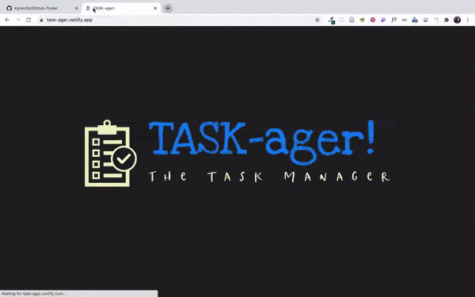

# Task-ager: The Task Manager

Web-based task management application built with ReactJS. Works offline and can be installed as a progressive web app.

[Click here](https://task-ager.netlify.app/) for a preview.

# Demo

# Install App as PWA

Refer to this [blog post](https://mobilesyrup.com/2020/05/24/how-install-progressive-web-app-pwa-android-ios-pc-mac/) for instructions on how to install this application as a PWA.
